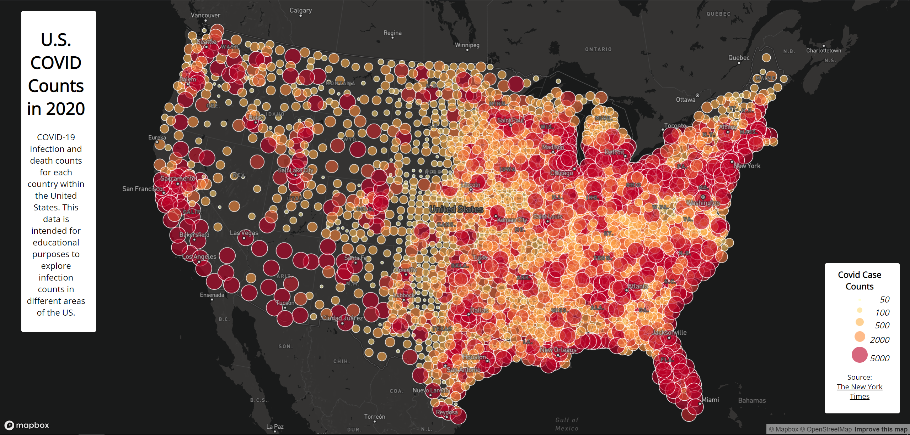

# geog458-covidrates
## 2020 US Covid-19 Maps

This lab explores the rates and counts of Covid in the US in 2020. The data is tracked by county, with a map for county count and rates.

Maps were constructed with [Mapbox](https://docs.mapbox.com/mapbox-gl-js/api/).

Data originated from:
- [The New York Times](https://github.com/nytimes/covid-19-data/blob/43d32dde2f87bd4dafbb7d23f5d9e878124018b8/live/us-counties.csv)
- [ACS](https://data.census.gov/cedsci/table?g=0100000US%24050000&d=ACS%205-Year%20Estimates%20Data%20Profiles&tid=ACSDP5Y2018.DP05&hidePreview=true)
- [The US Census Bureau](https://www.census.gov/geographies/mapping-files/time-series/geo/carto-boundary-file.html)

### [Map 1](https://blueal.github.io/geog458-covidrates/map1)

Map depicting Covid Case Rates by County

### [Map 2](https://blueal.github.io/geog458-covidrates/map2)

Map depicting Covid Case Counts by County

On each map, a user may click on a county to see a popup containing more information. The legend in the bottom right corner contains the neccesary information to understand the coloring and sizing if applicable.
